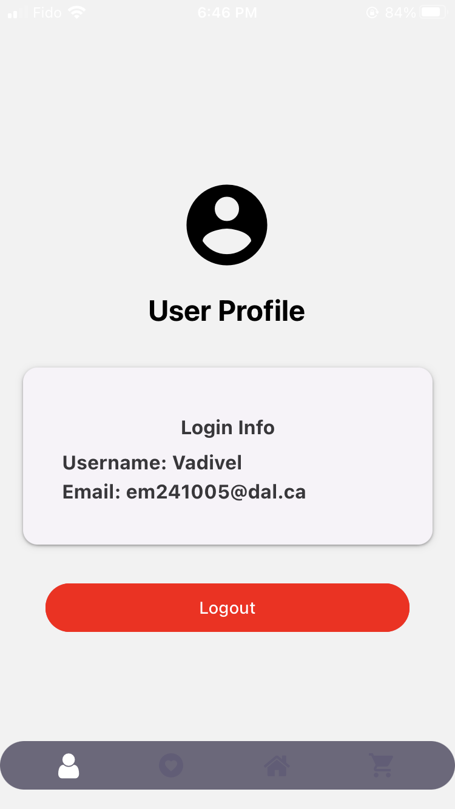
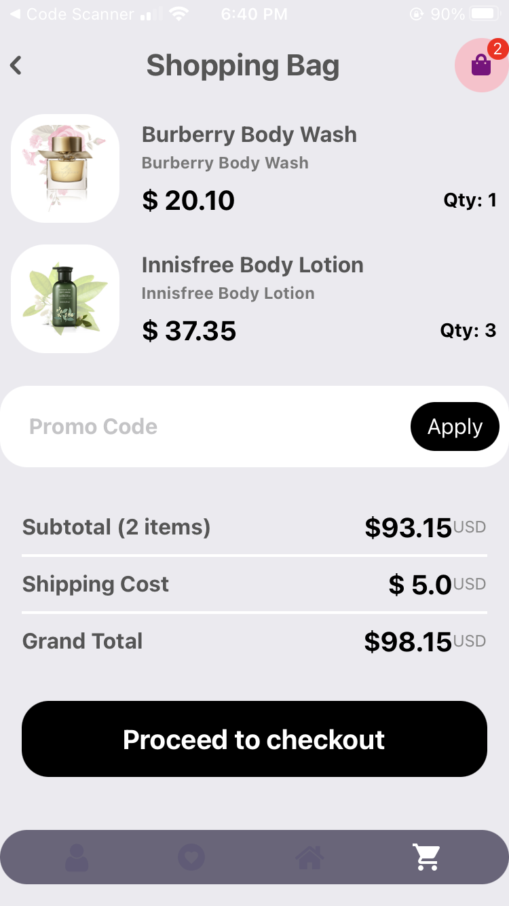

# BStore: Your Ultimate Beauty Products Store


BStore is cloud native hybrid mobile application project that leverages React Native and several AWS services to create a captivating, user-friendly mobile app for a beauty product shop.

## React Native
React Native is a popular JavaScript framework for building native mobile apps using a single codebase. You will develop cross-platform mobile applications for both iOS and Android platforms, leveraging the efficiency and flexibility of React Native.

## Demo Video


## AWS Services
The application heavily relies on several AWS services. Here's a brief rundown:

- AWS Lambda for running serverless functions.
- AWS S3 for storing high-resolution product images.
- AWS DynamoDB for storing product details.
- AWS Cognito for user authentication.
- AWS SNS for sending notifications to users.
- AWS API Gateway for managing the application's APIs.
- AWS Step Functions for coordinating multiple AWS lambda functions into serverless workflows.

## Architecture Diagram


## Categories of AWS Services used in this application


## Demonstration Screenshots

# Demo on iOS

|   |   |   |   |
|---|---|---|---|
|  |  |  |  |
|  |  |  |  |
|  |  |  |  |
|  |  |  |  |
|  |  |  |  |
|  |  |  |  |
|  |  |  |  |
|  |  |  |  |
|  |  |  |  |


## Basic Workflow of my application


## Getting Started

### To create an Expo app

```bash
expo init
```
### To run the app
```
npx expo start --tunnel
